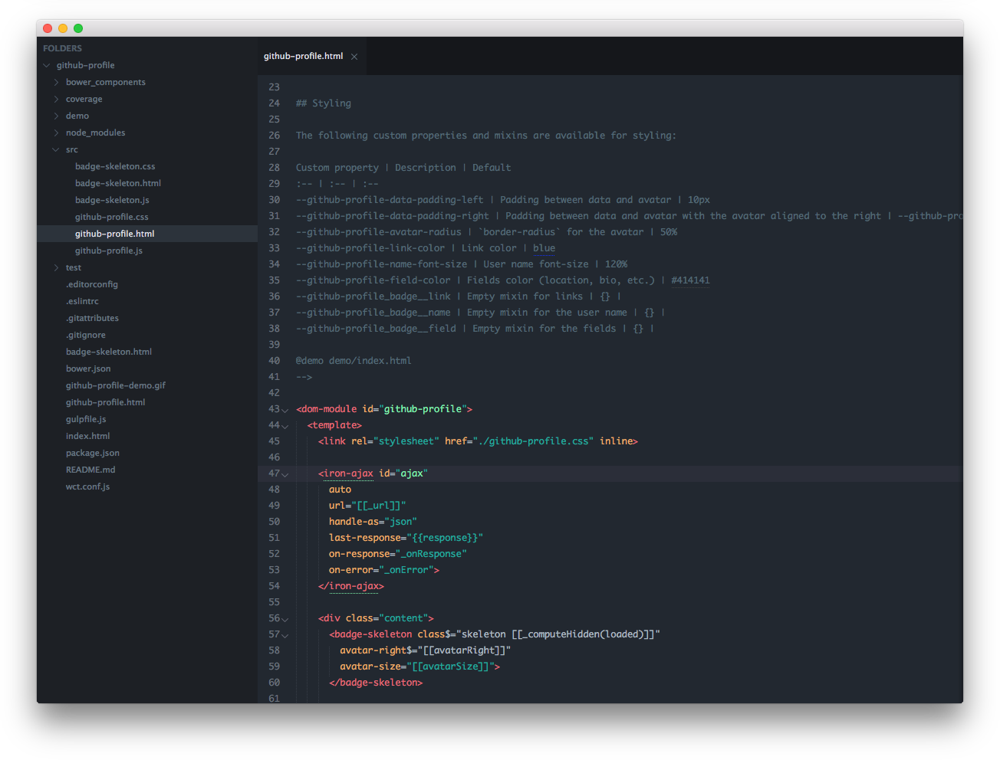
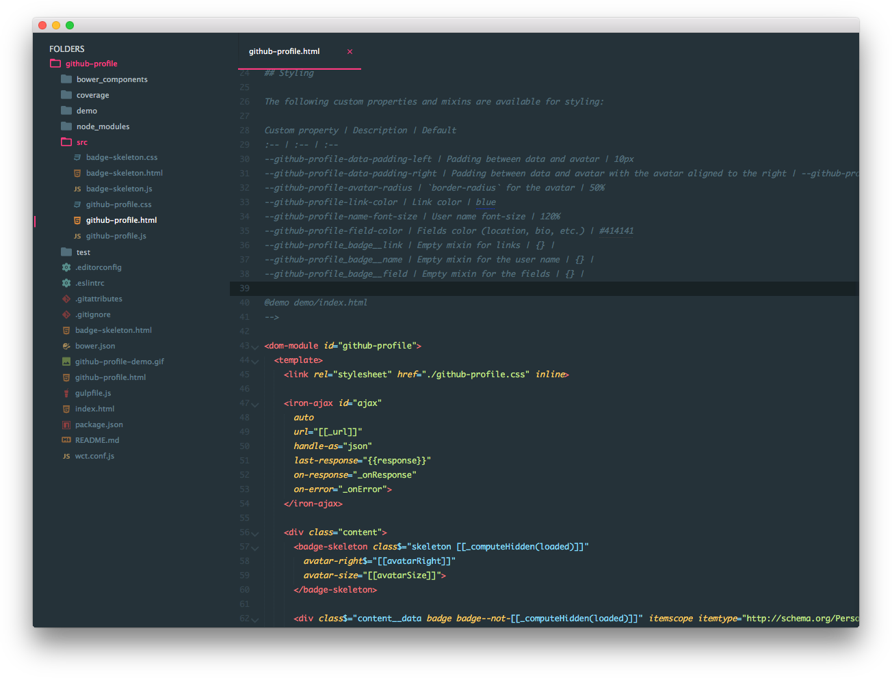
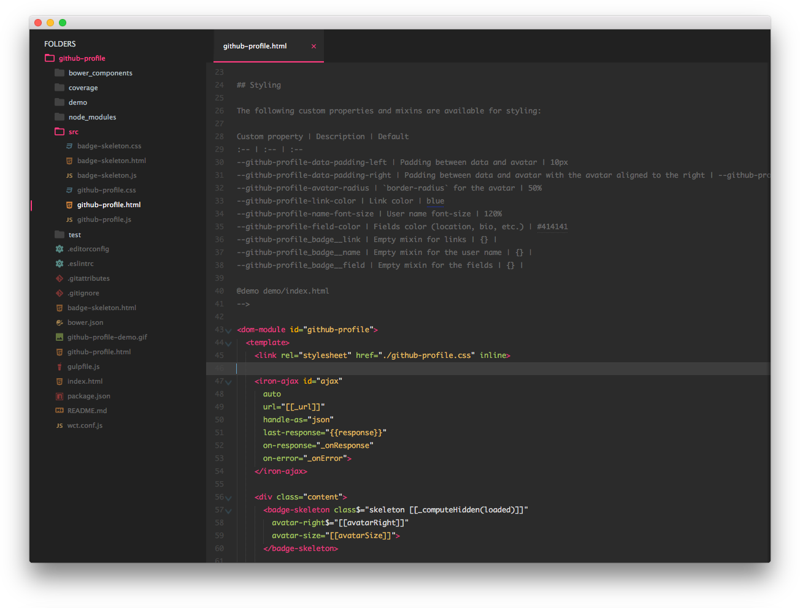
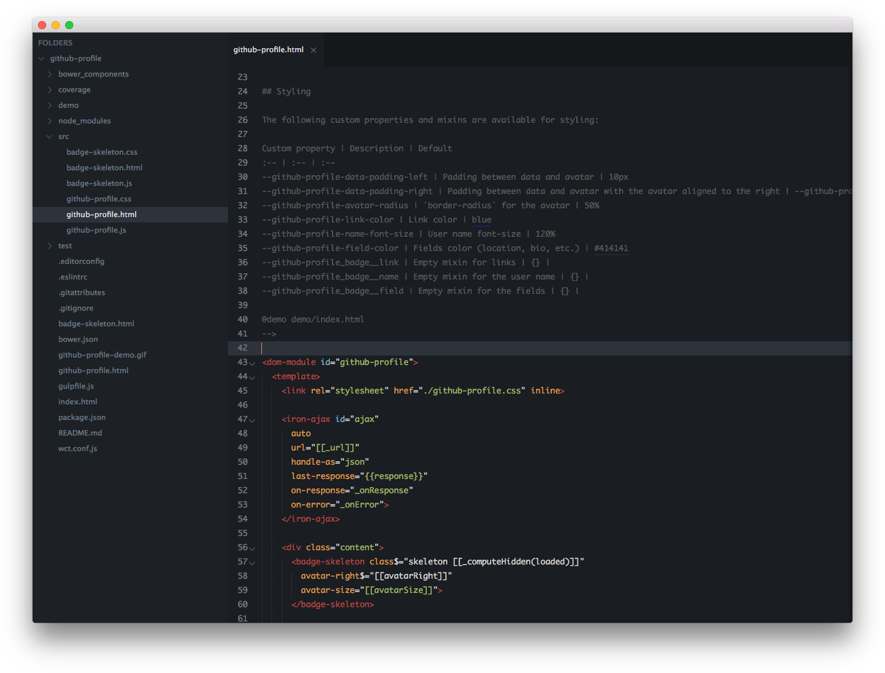
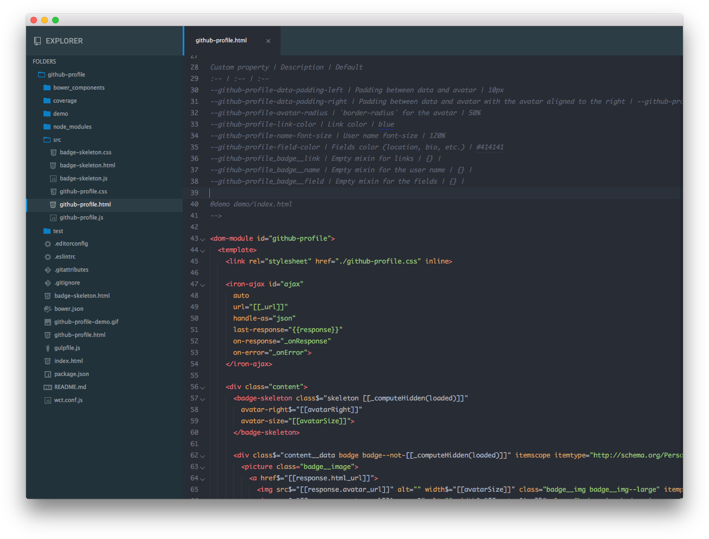

# Kustom Color Schemes for Sublime Text

Subtle modifications of 5 popular Sublime Text Themes.

**Yerga Theme**   
Based on Monokate and Spaceblack Alt Color Schemes.
Used with Spaceblack Theme.

**Moncalvillo Theme**   
Based on Material Color Scheme.
Used with Material Theme.

**Urbion Theme**    
Based on Monokai Gravity.
Used with Material Theme Darker.

**Cameros Theme**   
Based on Spaceblack Alt.
Used with Spaceblack Theme.

**Bilibio Theme**   
Based on TwoDark Theme (One Dark).
Used with Boxy Ocean Theme.

